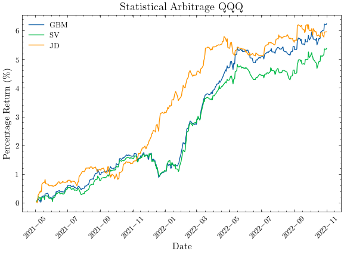

# Stochastic Option Pricing and Backtesting

This is a Python project in which we evaluate prices of American-style stock options through Monte Carlo simulation, using different models for the underlying stock. Based on this pricing engine, we implement Statistical Arbitrage and Delta-Hedging strategies, testing them against historical market data for SPY, QQQ, and AAPL options.

## Features

- **Pricing Models:** Geometric Brownian Motion, Heston Stochastic Volatility, Merton Jump-Diffusion, each used together with the Least Squares Monte Carlo algorithm.
- **Backtesting:**
    - Statistical Arbitrage: Open long/short positions on mispriced options and manage them using a take-profit/stop-loss approach.
    - Delta-Hedging: Open delta-neutral option-stock positions to mitigate market fluctuations in the context of market making.
- **Historical Market Data:** We provide a complete data-processing pipeline, using historical option chains both for computing model parameters, as well as backtesting.
- **Result Analysis:** Generate profit curves and detailed trade logs in `.csv` format.

## Project Structure

```
project/
├── datasets/                   # Historical market data
├── results/                    # Plots and trade logs
├── src/
│   ├── backtest.py             # Main script
│   ├── config.json5            # Backtest parameter setup
│   └── helpers/
│       ├── option_pricing.py   # Pricing engine
│       ├── data_utils.py       # Data loading and model parameters
│       └── strategies.py       # Backtest strategies
├── requirements.txt
└── README.md
```

## Running a Backtest

Please check the required Python libraries in the `requirements.txt` file.

To run a backtest, first set the desired test parameters in the `config.json5` file. Some of the most important parameters that can be chosen are the stock ticker to test on, the strategy, the model used for the stochastic simulation, as well as the test period.

Then, simply run the `backtest.py` file from the `src` folder. A profit plot and a `.csv` file of the executed trades will be created in `results/`.

## Example Backtest Result

<p align="center">
    
</p>

Please note that the plot above represents a comparison of the stock models. By default, only a single stock model can be used at a time in the backtest.
